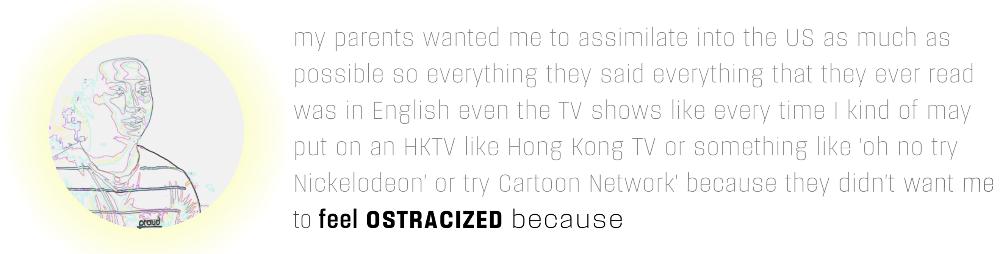

# PARALINGUISTIC HYPERTEXT
### Visualizing Conversation Through Expressive Digital Text
 
by  
<b>Kii Kang</b>   Hypertext interaction design and development, raw data processing 
<b>Megan Prakash</b>  Webpage backend development, layout design and development

#### Abstract

Text medium is seemingly flat and linear, but this was not the case before the typewriter. Handwritings and calligraphies often express the writers’ personalities and identities. Mechanical writings and digital texts, however, tend to flatten the complex dimensions into one single stream of letters. Through this project, we want to introduce rich and expressive affordances of writings in digital typefaces by adding high dimensional data associated with the text, namely <i>paralinguistic</i> cues, such as prosody, pitch, volume, intonation, or hesitancy. Our data consists of recorded speech which contains a conversation between immigrant parents and first-generation (US) Americans. We aim for an interactive and expressive visualization that encodes what happens throughout the conversation, inviting the viewers to make meaningful comparisons and associations, and to easily grasp the themes and sentiments even without watching or listening to the video. 
The project is twofold. First, we unpack the contents of the conversation and lay out our findings in a web environment based on their themes. These include family, belonging, cultural heritage, as well as the speakers, whether they are immigrants or first-generation Americans. Second, we present “hypertext,” an augmented form of digital text, using variable fonts that allow continuous interpolation of font styles — thickness, obliqueness, width, size, or even the design of the embellishments. The text is presented in real time, in sync with the audio that is being played alongside.

Find the full paper [here](final/paper.pdf).

